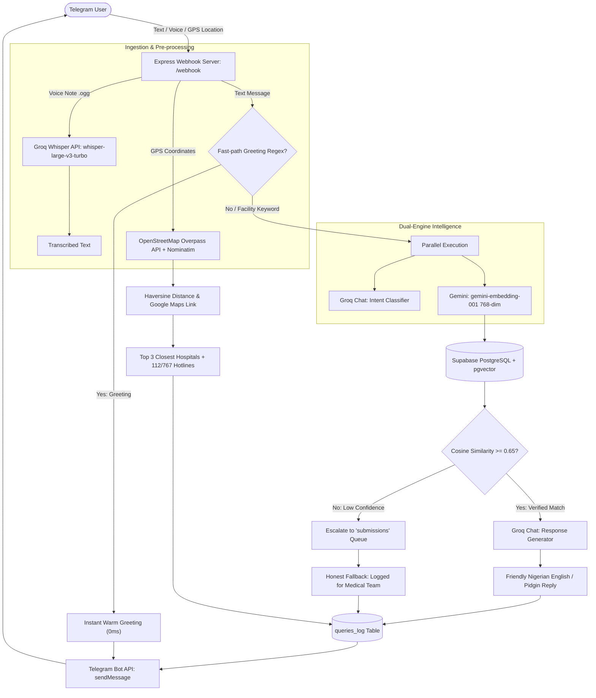

# 🌿 SabiHealth Bot: AI-Powered Community Health Fact-Checker & Emergency Care Locator

[](https://bun.sh)
[](https://www.typescriptlang.org/)
[-3ecf8e?logo=supabase&logoColor=white)](https://supabase.com)
[-4285f4?logo=google&logoColor=white)](https://aistudio.google.com)
[-f55036?logo=fastapi&logoColor=white)](https://groq.com)
[](https://telegram.org)
[](https://www.docker.com)

> **SabiHealth Bot** is a localized, multimodal conversational health assistant built for Nigerian and African communities. It combats life-threatening health misinformation on social messaging channels, transcribes voice notes in real-time, answers health questions in plain English and Nigerian Pidgin using hallucination-resistant RAG, and guides users to the nearest verified medical clinics in emergencies.

---

## 🌟 Key Features

- 🌿 **Hallucination-Resistant Fact Checking (RAG)**: Uses Supabase PostgreSQL with `pgvector` and 768-dimensional embeddings (`gemini-embedding-001`) to match queries strictly against verified facts from the WHO, Nigeria Centre for Disease Control (NCDC), and National Primary Health Care Development Agency (NPHCDA).
- 🎙️ **Voice Note Processing (Groq Whisper)**: Enables accessibility for low-literacy communities. Users send voice notes via Telegram, which are transcribed into text in milliseconds using `whisper-large-v3-turbo` on Groq.
- 🗣️ **Culturally Attuned Conversational Persona**: Replies sound like a knowledgeable, warm Nigerian friend texting you back on WhatsApp/Telegram—short, casual sentences with natural Pidgin phrases, zero robotic jargon, and no formal academic lecturing.
- 🏥 **Real-Time GPS Emergency & Hospital Locator**: Users share their live GPS pin to receive the top 3 nearest verified hospitals and clinics with live distance calculations (Haversine formula), direct Google Maps routing links, and immediate emergency hotline prompts (`112` National Toll-free, `767` Lagos).
- 🛡️ **Confidence Thresholding & Human Escalation**: Matches below the strict confidence threshold (`< 0.65 similarity`) are automatically routed to a `submissions` table for human medical review, while reassuring the user honestly rather than guessing.
- ⚡ **Ultra-Fast Parallel Pipeline**:
  - **0ms Greeting Fast-Path**: Regex detection bypasses API calls for instant greetings.
  - **Parallel Intent & Embedding**: Concurrent classification (`GREETING`, `MEDICAL`, `OTHER`) and vector embedding generation.
  - **Resilient Fallbacks**: Dual Overpass API mirrors with OpenStreetMap Nominatim secondary fallback for geospatial lookups.
  - **Exponential Backoff**: Automatic retry logic for resilient AI provider communication.
- 📊 **Complete Audit Logging**: Every query, match ID, confidence score, and escalation status is stored in Supabase `queries_log` with dual-tier fallback (`@supabase/supabase-js` + direct Postgres pool).

---

## 🏗️ Architecture & Data Flow



---

## 📁 Repository Structure

```plaintext
sabihealth_bot/
├── index.ts             # Main production webhook server (Express, Telegram handlers, Voice, OSM Locator)
├── pipeline-test.ts     # Core RAG pipeline, intent classification, Groq generation, and CLI tester
├── embed-test.ts        # Script to batch-generate and backfill 768-dim embeddings in Supabase
├── match-test.ts        # Verification script for pgvector cosine distance matching (<=>)
├── schema.sql           # Complete PostgreSQL schema (tables, vector extensions, HNSW index, seeded facts)
├── Dockerfile           # Production container build using Oven Bun
├── package.json         # Bun scripts and production dependencies
├── tsconfig.json        # TypeScript compiler configurations
├── .env.example         # Template for all environment variables
└── README.md            # Comprehensive project documentation
```

---

## 🗄️ Database Schema (`schema.sql`)

The database is built on **PostgreSQL** hosted on **Supabase** with the `pgvector` extension enabled:

1. **`fact_library`**: Verified medical facts and debunked myths.
   - `id`: Unique serial ID.
   - `myth`: Common rumor or myth circulating in communities.
   - `fact`: Medically verified truth from WHO/NCDC/NPHCDA.
   - `category`: Topic category (e.g., Malaria, Medications, Infectious Disease).
   - `embedding`: Vector column (`vector(768)`), indexed using HNSW for rapid cosine distance search.
2. **`submissions`**: Escalation queue for unverified rumors.
   - `phone_number`: User identifier.
   - `rumor_text`: The unverified user query.
   - `status`: Lifecycle tracker (`pending`, `reviewed`, `verified`, `dismissed`).
3. **`queries_log`**: Real-time analytics, user audits, and monitoring.
   - `phone_number`: User/Chat ID.
   - `question_text`: User inquiry or location coordinates.
   - `matched_fact_id`: Foreign key reference to `fact_library`.
   - `confidence_score`: Cosine similarity score (0.0 to 1.0).
   - `escalated`: Boolean flag indicating if human escalation was triggered.

---

## 🚀 Quick Start Guide

### 1. Prerequisites
- [Bun](https://bun.sh) (v1.0 or higher) installed locally.
- A free [Supabase](https://supabase.com) account and project.
- A [Google AI Studio API Key](https://aistudio.google.com/apikey).
- A [Groq Cloud API Key](https://console.groq.com/keys).
- A [Telegram Bot Token](https://t.me/BotFather) from `@BotFather`.

### 2. Environment Configuration
Clone the repository and copy the environment template:

```bash
git clone https://github.com/Emafido/sabihealth_bot.git
cd sabihealth_bot
cp .env.example .env
```

Open `.env` and fill in your credentials:

```env
# Supabase Postgres connection string (URI format with pgbouncer or pooler)
DATABASE_URL=postgresql://postgres:[PASSWORD]@[HOST]:6543/postgres

# Supabase JS API credentials
SUPABASE_URL=https://[YOUR-PROJECT-REF].supabase.co
SUPABASE_KEY=your_supabase_anon_or_service_role_key

# Google Gemini API Key (Embeddings)
GEMINI_API_KEY=your_gemini_api_key

# Groq API Key & Model (Whisper + Conversational LLM)
GROQ_API_KEY=gsk_your_groq_api_key
GROQ_CHAT_MODEL=openai/gpt-oss-20b

# Telegram Bot Token
TELEGRAM_BOT_TOKEN=123456789:ABCdefGHIjklMNOpqrSTUvwxYZ

# Port
PORT=3000
```

### 3. Database Initialization
1. Go to your **Supabase Dashboard** -> **SQL Editor**.
2. Open [`schema.sql`](./schema.sql), paste its contents, and execute.
3. This creates all tables, indexes, enables `pgvector`, and seeds 8 foundational Nigerian health myths.

### 4. Backfill Vector Embeddings
Generate 768-dimensional vector representations for all seeded facts using Gemini:

```bash
bun run embed
# Output:
# 📋 Found 8 facts in fact_library. Starting embedding generation...
# ✅ [#1] Embedding updated successfully (dimensions: 768)
# 🎉 Embedding backfill completed: 8/8 rows updated successfully!
```

### 5. Test Vector Matching & Pipeline (CLI)
Test semantic vector similarity in the terminal without launching the server:

```bash
# Test vector similarity search
bun run match "my aunty said herbs can cure malaria instead of drugs"

# Test end-to-end RAG pipeline
bun run pipeline "people say hot salt water bath cures cholera"
```

---

## 🤖 Running the Telegram Bot Webhook Server

### Local Development with Ngrok

1. Start the server locally:
```bash
bun run start
```
The server will start on `http://localhost:3000`.

2. In a separate terminal, expose your local port:
```bash
ngrok http 3000
```
Copy your forwarding URL (e.g. `https://xxxx.ngrok-free.app`).

3. Register your webhook with Telegram:
```bash
curl -F "url=https://xxxx.ngrok-free.app/webhook" https://api.telegram.org/bot<YOUR_TELEGRAM_BOT_TOKEN>/setWebhook
```

4. Open your bot on Telegram and test:
   - Send `/start`
   - Send text: *"Can antibiotics cure my cold and flu?"*
   - Send a voice note asking about malaria herbs!
   - Tap **"📍 Share Location for Nearby Hospitals"** to find clinics near you.

---

## 🐳 Docker Deployment

The application includes an optimized, production-ready `Dockerfile`:

```bash
# Build the Docker image
docker build -t sabihealth-bot .

# Run the container
docker run -d -p 3000:3000 --env-file .env --name sabihealth-app sabihealth-bot
```

---

## 🛡️ Medical Disclaimer

*SabiHealth Bot is an informational health fact-checking tool designed to reduce community misinformation and connect individuals with verified primary healthcare centers. It does not replace professional medical diagnosis, prescription, or clinical consultation. Users experiencing severe symptoms or acute medical emergencies are directed to call 112/767 or visit the nearest licensed hospital immediately.*

---

## 📄 License

This project is licensed under the MIT License.
